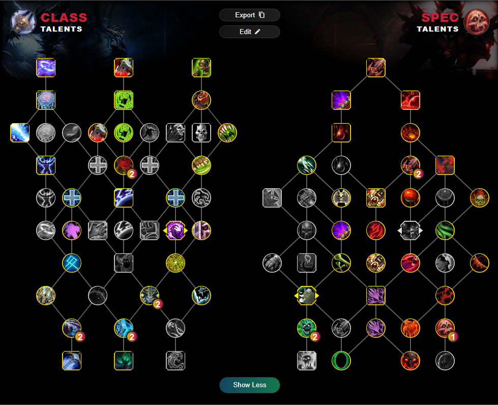

# Karoshi vs Raszageth

## Talents 
* Talents have been taken after changes on the 24th of Jan class changes
* Any changes or additions feel free to DM Madrexus#0001
* Talants are the most common I have seen for the fight, Don't think of anything too innovative unless its warlock or spriest where I have half an idea on what's going on.
### Tanks
\
[Blood Death Knight](#blood-death-knight)
\
Guradian Druid
\
Brewmaster Monk
\
Protection Paladin
\
Protection Warrior

### Healers
\
Restoration Druid
\
Preservation Evoker
\
Mistweaver Monk
\
Holy Paladin
\
Holy Priest
\
Discipline Priest
\
Restoration Shamen

### Melee DPS
\
Frost Death Knight
\
Unholy Death Knight
\
Havoc Demon Hunter
\
Feral Druid
\
Survival Hunter
\
Windwalker Monk
\
Retribution Paladin
\
Assassination Rogue
\
Outlaw Rogue
\
Subtlety Rogue
\
Enhancement Shamen
\
Arms Warrior
\
Fury Warrior
### Range DPS
\
Balence Druid
\
Devastation Evoker
\
Beast Mastery Hunter
\
Marksmanship Hunter
\
Arcane Mage
\
Fire Mage
\
Frost Mage 
\
Shadow Priest
\
Elemental Shaman
\
Affliction Warlock
\
Demonology Warlock
\
Destruction Warlock

### Tanks
\
#### Blood Death Knight
\
\
Talent String:
\
BoPAAAAAAAAAAAAAAAAAAAAAAACJJCJJi0iERkISIIJSkAAAAAAkIJOQik0EiEAAQkkkEAAAA
\
\

\
#### Guradian Druid
\
\
Talent String:
\
BoPAAAAAAAAAAAAAAAAAAAAAAACJJCJJi0iERkISIIJSkAAAAAAkIJOQik0EiEAAQkkkEAAAA
\
\

\
#### Brewmaster Monk
\
\
Talent String:
\
BoPAAAAAAAAAAAAAAAAAAAAAAACJJCJJi0iERkISIIJSkAAAAAAkIJOQik0EiEAAQkkkEAAAA
\
\

\
#### Protection Paladin
\
\
Talent String:
\
BoPAAAAAAAAAAAAAAAAAAAAAAACJJCJJi0iERkISIIJSkAAAAAAkIJOQik0EiEAAQkkkEAAAA
\
\

\
#### Protection Warrior
\
Talent String:
\
BoPAAAAAAAAAAAAAAAAAAAAAAACJJCJJi0iERkISIIJSkAAAAAAkIJOQik0EiEAAQkkkEAAAA

### Healers
\
#### Restoration Druid
\
\
Talent String:
\
BoPAAAAAAAAAAAAAAAAAAAAAAACJJCJJi0iERkISIIJSkAAAAAAkIJOQik0EiEAAQkkkEAAAA
\
\

\
#### Preservation Evoker
\
\
Talent String:
\
BoPAAAAAAAAAAAAAAAAAAAAAAACJJCJJi0iERkISIIJSkAAAAAAkIJOQik0EiEAAQkkkEAAAA
\
\

\
#### Mistweaver Monk
\
\
Talent String:
\
BoPAAAAAAAAAAAAAAAAAAAAAAACJJCJJi0iERkISIIJSkAAAAAAkIJOQik0EiEAAQkkkEAAAA
\
\

\
#### Holy Paladin
\
\
Talent String:
\
BoPAAAAAAAAAAAAAAAAAAAAAAACJJCJJi0iERkISIIJSkAAAAAAkIJOQik0EiEAAQkkkEAAAA
\
\

\
#### Holy Priest
\
\
Talent String:
\
BoPAAAAAAAAAAAAAAAAAAAAAAACJJCJJi0iERkISIIJSkAAAAAAkIJOQik0EiEAAQkkkEAAAA
\
\

\
#### Discipline Priest
\
\
Talent String:
\
BoPAAAAAAAAAAAAAAAAAAAAAAACJJCJJi0iERkISIIJSkAAAAAAkIJOQik0EiEAAQkkkEAAAA
\
\

\
#### Restoration Shamen
\
\
Talent String:
\
BoPAAAAAAAAAAAAAAAAAAAAAAACJJCJJi0iERkISIIJSkAAAAAAkIJOQik0EiEAAQkkkEAAAA
\
\

### Melee DPS
\
#### Frost Death Knight
\
\
Talent String:
\
BoPAAAAAAAAAAAAAAAAAAAAAAACJJCJJi0iERkISIIJSkAAAAAAkIJOQik0EiEAAQkkkEAAAA
\
\

\
#### Unholy Death Knight
\
\
Talent String:
\
BoPAAAAAAAAAAAAAAAAAAAAAAACJJCJJi0iERkISIIJSkAAAAAAkIJOQik0EiEAAQkkkEAAAA
\
\

\
#### Havoc Demon Hunter
\
\
Talent String:
\
BoPAAAAAAAAAAAAAAAAAAAAAAACJJCJJi0iERkISIIJSkAAAAAAkIJOQik0EiEAAQkkkEAAAA
\
\

\
#### Feral Druid
\
\
Talent String:
\
BoPAAAAAAAAAAAAAAAAAAAAAAACJJCJJi0iERkISIIJSkAAAAAAkIJOQik0EiEAAQkkkEAAAA
\
\

\
#### Survival Hunter
\
\
Talent String:
\
BoPAAAAAAAAAAAAAAAAAAAAAAACJJCJJi0iERkISIIJSkAAAAAAkIJOQik0EiEAAQkkkEAAAA
\
\

\
#### Windwalker Monk
\
\
Talent String:
\
BoPAAAAAAAAAAAAAAAAAAAAAAACJJCJJi0iERkISIIJSkAAAAAAkIJOQik0EiEAAQkkkEAAAA
\
\

\
#### Retribution Paladin
\
\
Talent String:
\
BoPAAAAAAAAAAAAAAAAAAAAAAACJJCJJi0iERkISIIJSkAAAAAAkIJOQik0EiEAAQkkkEAAAA
\
\

\
#### Assassination Rogue
\
\
Talent String:
\
BoPAAAAAAAAAAAAAAAAAAAAAAACJJCJJi0iERkISIIJSkAAAAAAkIJOQik0EiEAAQkkkEAAAA
\
\

\
#### Outlaw Rogue
\
\
Talent String:
\
BoPAAAAAAAAAAAAAAAAAAAAAAACJJCJJi0iERkISIIJSkAAAAAAkIJOQik0EiEAAQkkkEAAAA
\
\

\
#### Subtlety Rogue
\
\
Talent String:
\
BoPAAAAAAAAAAAAAAAAAAAAAAACJJCJJi0iERkISIIJSkAAAAAAkIJOQik0EiEAAQkkkEAAAA
\
\

\
#### Enhancement Shamen
\
\
Talent String:
\
BoPAAAAAAAAAAAAAAAAAAAAAAACJJCJJi0iERkISIIJSkAAAAAAkIJOQik0EiEAAQkkkEAAAA
\
\

\
#### Arms Warrior
\
\
Talent String:
\
BoPAAAAAAAAAAAAAAAAAAAAAAACJJCJJi0iERkISIIJSkAAAAAAkIJOQik0EiEAAQkkkEAAAA
\
\

\
#### Fury Warrior
\
\
Talent String:
\
BoPAAAAAAAAAAAAAAAAAAAAAAACJJCJJi0iERkISIIJSkAAAAAAkIJOQik0EiEAAQkkkEAAAA
\
\

\
### Range DPS
\
#### Balence Druid
\
\
Talent String:
\
BoPAAAAAAAAAAAAAAAAAAAAAAACJJCJJi0iERkISIIJSkAAAAAAkIJOQik0EiEAAQkkkEAAAA
\
\

\
#### Devastation Evoker
\
\
Talent String:
\
BoPAAAAAAAAAAAAAAAAAAAAAAACJJCJJi0iERkISIIJSkAAAAAAkIJOQik0EiEAAQkkkEAAAA
\
\

\
#### Beast Mastery Hunter
\
\
Talent String:
\
BoPAAAAAAAAAAAAAAAAAAAAAAACJJCJJi0iERkISIIJSkAAAAAAkIJOQik0EiEAAQkkkEAAAA
\
\

\
#### Marksmanship Hunter
\
\
Talent String:
\
BoPAAAAAAAAAAAAAAAAAAAAAAACJJCJJi0iERkISIIJSkAAAAAAkIJOQik0EiEAAQkkkEAAAA
\
\

\
#### Arcane Mage
\
\
Talent String:
\
BoPAAAAAAAAAAAAAAAAAAAAAAACJJCJJi0iERkISIIJSkAAAAAAkIJOQik0EiEAAQkkkEAAAA
\
\

\
#### Fire Mage
\
\
Talent String:
\
BoPAAAAAAAAAAAAAAAAAAAAAAACJJCJJi0iERkISIIJSkAAAAAAkIJOQik0EiEAAQkkkEAAAA
\
\

\
#### Frost Mage
\
\
Talent String:
\
BoPAAAAAAAAAAAAAAAAAAAAAAACJJCJJi0iERkISIIJSkAAAAAAkIJOQik0EiEAAQkkkEAAAA
\
\

\
#### Shadow Priest
\
\
Talent String:
\
BoPAAAAAAAAAAAAAAAAAAAAAAACJJCJJi0iERkISIIJSkAAAAAAkIJOQik0EiEAAQkkkEAAAA
\
\

\
#### Elemental Shaman
\
\
Talent String:
\
BoPAAAAAAAAAAAAAAAAAAAAAAACJJCJJi0iERkISIIJSkAAAAAAkIJOQik0EiEAAQkkkEAAAA
\
\

\
#### Affliction Warlock
\
\
Talent String:
\
BoPAAAAAAAAAAAAAAAAAAAAAAACJJCJJi0iERkISIIJSkAAAAAAkIJOQik0EiEAAQkkkEAAAA
\
\

\
#### Demonology Warlock
\
\
Talent String:
\
BoPAAAAAAAAAAAAAAAAAAAAAAACJJCJJi0iERkISIIJSkAAAAAAkIJOQik0EiEAAQkkkEAAAA
\
\

\
#### Destruction Warlock
\
\
Talent String:
\
BoPAAAAAAAAAAAAAAAAAAAAAAACJJCJJi0iERkISIIJSkAAAAAAkIJOQik0EiEAAQkkkEAAAA
\
\
