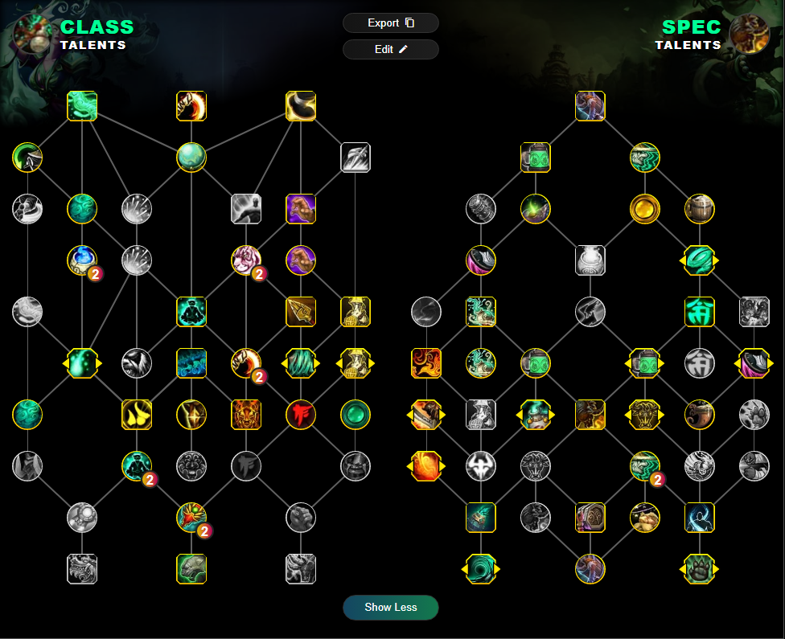
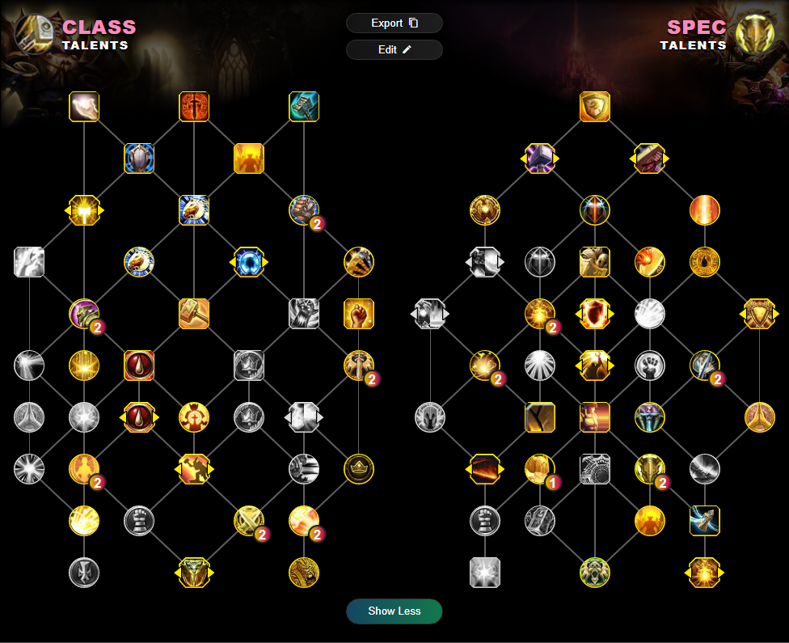
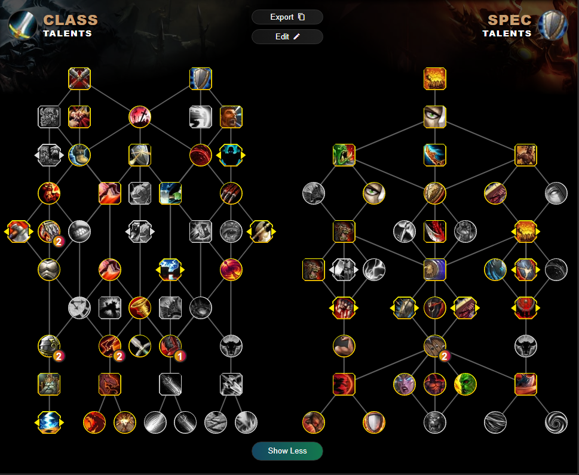
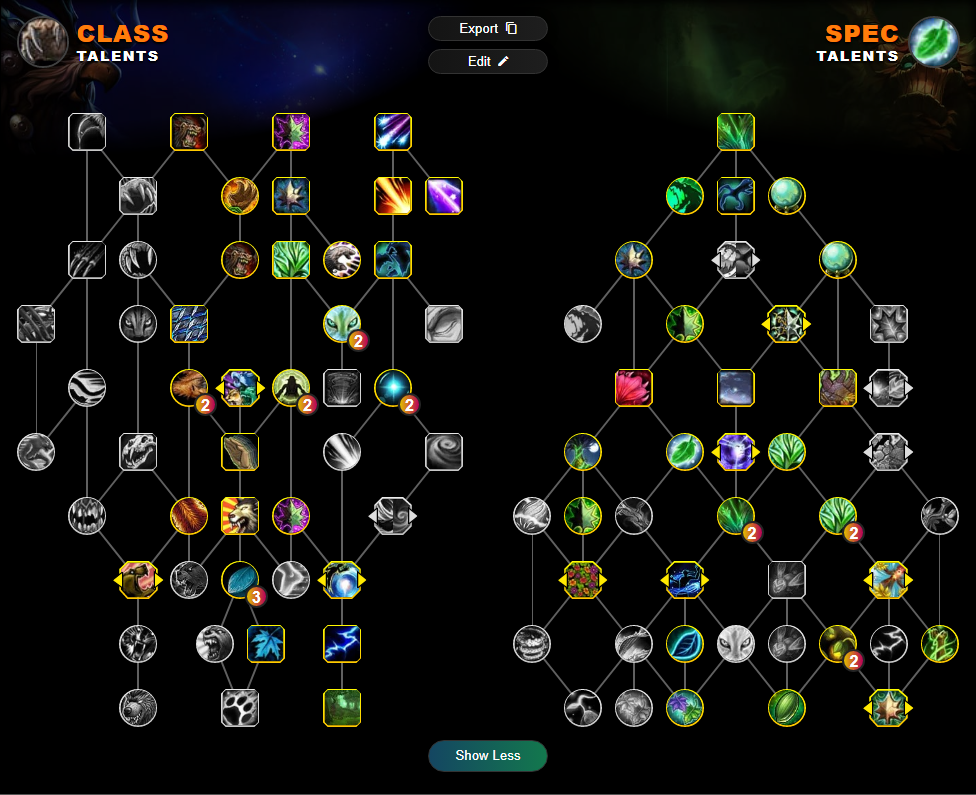

# Karoshi vs Raszageth

## Talents 
* Talents have been taken after changes on the 24th of Jan class changes
* Any changes or additions feel free to DM Madrexus#0001
* Talants are the most common I have seen for the fight, Don't think of anything too innovative unless its warlock or spriest where I have half an idea on what's going on.
### Tanks
\
[Blood Death Knight](#blood-death-knight)
\
[Guradian Druid](#guradian-druid)
\
[Brewmaster Monk](#brewmaster-monk)
\
[Protection Paladin](#protection-paladin)
\
[Protection Warrior](#protection-warrior)

### Healers
\
[Restoration Druid](#restoration-druid)
\
[Preservation Evoker](#preservation-evoker)
\
[Mistweaver Monk](#mistweaver-monk)
\
[Holy Paladin](#holy-paladin)
\
[Holy Priest](#holy-priest)
\
[Discipline Priest](#discipline-priest)
\
[Restoration Shamen](#restoration-shamen)

### Melee DPS
\
[Frost Death Knight](#frost-death-knight)
\
[Unholy Death Knight](#unholy-death-knight)
\
[Havoc Demon Hunter](#havoc-demon-hunter)
\
[Feral Druid](#feral-druid)
\
[Survival Hunter](#survival-hunter)
\
[Windwalker Monk](#windwalker-monk)
\
[Retribution Paladin](#retribution-paladin)
\
[Assassination Rogue](#assassination-rogue)
\
[Outlaw Rogue](#outlaw-rogue)
\
[Subtlety Rogue](#subtlety-rogue)
\
[Enhancement Shamen](#enhancement-shamen)
\
[Arms Warrior](#arms-warrior)
\
[Fury Warrior](#fury-warrior)
### Range DPS(#)
\
[Balence Druid](#balence-druid)
\
[Devastation Evoker](#devastation-evoker)
\
[Beast Mastery Hunter](#beast-mastery-hunter)
\
[Marksmanship Hunter](#marksmanship-hunter)
\
[Arcane Mage](#arcane-mage)
\
[Fire Mage](#fire-mage)
\
[Frost Mage](#frost-mage)
\
[Shadow Priest](#shadow-priest)
\
[Elemental Shaman](#elemental-shaman)
\
[Affliction Warlock](#affliction-warlock)
\
[Demonology Warlock](#demonology-warlock)
\
[Destruction Warlock](#destruction-warlock)

### Tanks

#### Blood Death Knight
\
Notes: N/A
\
\
Talent String:
\
BoPAAAAAAAAAAAAAAAAAAAAAAACJJCJJi0iERkISIIJSkAAAAAAkIJOQik0EiEAAQkkkEAAAA
\
\

#### Guradian Druid
\
Notes: 1 Log (Pumps GOAT) - Tree from before the 24th, may require some changes.
\
\
Talent String:
\
BgGAAAAAAAAAAAAAAAAAAAAAAAAAAAAAAAAAAAASSkkokokkkEJQQShiAQCCSgkkkkkIFAOAAAAAAARAB
\
\

#### Brewmaster Monk
\
Notes: 1 Log - Might be niche
\
\
Talent String:
\
BwQAAAAAAAAAAAAAAAAAAAAAAAAAAAAAIBAAAAUiWLJJQSSpRAAAASJSLJSkQikIJSJJEaRi0SrEC
\
\

#### Protection Paladin
\
\
Talent String:
\
BIEAAAAAAAAAAAAAAAAAAAAAA0iWCpJaHISSiWTkkEBSAAAAAAAAAAAAAAQTSSSKJQClUEJhokG
\
\

\
#### Protection Warrior
\
Talent String:
\
BkEAAAAAAAAAAAAAAAAAAAAAAIEJAAAAgkkQSiItkSSSaQEIFFBUSSgCikE0CJJggDECAAAAAAAEBAgSrBA
\
\

### Healers
\
#### Restoration Druid
\
\
Talent String:
\
BkGAAAAAAAAAAAAAAAAAAAAAAQkkoUSSSUkWIRgU0ikAAAAAAAAAAAAAKChICCSCQSIJShkWCAAAAAARAAA
\
\

\
#### Preservation Evoker
\
\
Talent String:
\
BwbBAAAAAAAAAAAAAAAAAAAAAQB0yBEhISRSSItokkkgEAAAAAQk0SkACSkkkIh4AJB
\
\

\
#### Mistweaver Monk
\
\
Talent String:
\
BoPAAAAAAAAAAAAAAAAAAAAAAACJJCJJi0iERkISIIJSkAAAAAAkIJOQik0EiEAAQkkkEAAAA
\
\

\
#### Holy Paladin
\
\
Talent String:
\
BoPAAAAAAAAAAAAAAAAAAAAAAACJJCJJi0iERkISIIJSkAAAAAAkIJOQik0EiEAAQkkkEAAAA
\
\

\
#### Holy Priest
\
\
Talent String:
\
BoPAAAAAAAAAAAAAAAAAAAAAAACJJCJJi0iERkISIIJSkAAAAAAkIJOQik0EiEAAQkkkEAAAA
\
\

\
#### Discipline Priest
\
\
Talent String:
\
BoPAAAAAAAAAAAAAAAAAAAAAAACJJCJJi0iERkISIIJSkAAAAAAkIJOQik0EiEAAQkkkEAAAA
\
\

\
#### Restoration Shamen
\
\
Talent String:
\
BoPAAAAAAAAAAAAAAAAAAAAAAACJJCJJi0iERkISIIJSkAAAAAAkIJOQik0EiEAAQkkkEAAAA
\
\

### Melee DPS
\
#### Frost Death Knight
\
\
Talent String:
\
BoPAAAAAAAAAAAAAAAAAAAAAAACJJCJJi0iERkISIIJSkAAAAAAkIJOQik0EiEAAQkkkEAAAA
\
\

\
#### Unholy Death Knight
\
\
Talent String:
\
BoPAAAAAAAAAAAAAAAAAAAAAAACJJCJJi0iERkISIIJSkAAAAAAkIJOQik0EiEAAQkkkEAAAA
\
\

\
#### Havoc Demon Hunter
\
\
Talent String:
\
BoPAAAAAAAAAAAAAAAAAAAAAAACJJCJJi0iERkISIIJSkAAAAAAkIJOQik0EiEAAQkkkEAAAA
\
\

\
#### Feral Druid
\
\
Talent String:
\
BoPAAAAAAAAAAAAAAAAAAAAAAACJJCJJi0iERkISIIJSkAAAAAAkIJOQik0EiEAAQkkkEAAAA
\
\

\
#### Survival Hunter
\
\
Talent String:
\
BoPAAAAAAAAAAAAAAAAAAAAAAACJJCJJi0iERkISIIJSkAAAAAAkIJOQik0EiEAAQkkkEAAAA
\
\

\
#### Windwalker Monk
\
\
Talent String:
\
BoPAAAAAAAAAAAAAAAAAAAAAAACJJCJJi0iERkISIIJSkAAAAAAkIJOQik0EiEAAQkkkEAAAA
\
\

\
#### Retribution Paladin
\
\
Talent String:
\
BoPAAAAAAAAAAAAAAAAAAAAAAACJJCJJi0iERkISIIJSkAAAAAAkIJOQik0EiEAAQkkkEAAAA
\
\

\
#### Assassination Rogue
\
\
Talent String:
\
BoPAAAAAAAAAAAAAAAAAAAAAAACJJCJJi0iERkISIIJSkAAAAAAkIJOQik0EiEAAQkkkEAAAA
\
\

\
#### Outlaw Rogue
\
\
Talent String:
\
BoPAAAAAAAAAAAAAAAAAAAAAAACJJCJJi0iERkISIIJSkAAAAAAkIJOQik0EiEAAQkkkEAAAA
\
\

\
#### Subtlety Rogue
\
\
Talent String:
\
BoPAAAAAAAAAAAAAAAAAAAAAAACJJCJJi0iERkISIIJSkAAAAAAkIJOQik0EiEAAQkkkEAAAA
\
\

\
#### Enhancement Shamen
\
\
Talent String:
\
BoPAAAAAAAAAAAAAAAAAAAAAAACJJCJJi0iERkISIIJSkAAAAAAkIJOQik0EiEAAQkkkEAAAA
\
\

\
#### Arms Warrior
\
\
Talent String:
\
BoPAAAAAAAAAAAAAAAAAAAAAAACJJCJJi0iERkISIIJSkAAAAAAkIJOQik0EiEAAQkkkEAAAA
\
\

\
#### Fury Warrior
\
\
Talent String:
\
BoPAAAAAAAAAAAAAAAAAAAAAAACJJCJJi0iERkISIIJSkAAAAAAkIJOQik0EiEAAQkkkEAAAA
\
\

\
### Range DPS
\
#### Balence Druid
\
\
Talent String:
\
BoPAAAAAAAAAAAAAAAAAAAAAAACJJCJJi0iERkISIIJSkAAAAAAkIJOQik0EiEAAQkkkEAAAA
\
\

\
#### Devastation Evoker
\
\
Talent String:
\
BoPAAAAAAAAAAAAAAAAAAAAAAACJJCJJi0iERkISIIJSkAAAAAAkIJOQik0EiEAAQkkkEAAAA
\
\

\
#### Beast Mastery Hunter
\
\
Talent String:
\
BoPAAAAAAAAAAAAAAAAAAAAAAACJJCJJi0iERkISIIJSkAAAAAAkIJOQik0EiEAAQkkkEAAAA
\
\

\
#### Marksmanship Hunter
\
\
Talent String:
\
BoPAAAAAAAAAAAAAAAAAAAAAAACJJCJJi0iERkISIIJSkAAAAAAkIJOQik0EiEAAQkkkEAAAA
\
\

\
#### Arcane Mage
\
\
Talent String:
\
BoPAAAAAAAAAAAAAAAAAAAAAAACJJCJJi0iERkISIIJSkAAAAAAkIJOQik0EiEAAQkkkEAAAA
\
\

\
#### Fire Mage
\
\
Talent String:
\
BoPAAAAAAAAAAAAAAAAAAAAAAACJJCJJi0iERkISIIJSkAAAAAAkIJOQik0EiEAAQkkkEAAAA
\
\

\
#### Frost Mage
\
\
Talent String:
\
BoPAAAAAAAAAAAAAAAAAAAAAAACJJCJJi0iERkISIIJSkAAAAAAkIJOQik0EiEAAQkkkEAAAA
\
\

\
#### Shadow Priest
\
\
Talent String:
\
BoPAAAAAAAAAAAAAAAAAAAAAAACJJCJJi0iERkISIIJSkAAAAAAkIJOQik0EiEAAQkkkEAAAA
\
\

\
#### Elemental Shaman
\
\
Talent String:
\
BoPAAAAAAAAAAAAAAAAAAAAAAACJJCJJi0iERkISIIJSkAAAAAAkIJOQik0EiEAAQkkkEAAAA
\
\

\
#### Affliction Warlock
\
\
Talent String:
\
BoPAAAAAAAAAAAAAAAAAAAAAAACJJCJJi0iERkISIIJSkAAAAAAkIJOQik0EiEAAQkkkEAAAA
\
\

\
#### Demonology Warlock
\
\
Talent String:
\
BoPAAAAAAAAAAAAAAAAAAAAAAACJJCJJi0iERkISIIJSkAAAAAAkIJOQik0EiEAAQkkkEAAAA
\
\

\
#### Destruction Warlock
\
\
Talent String:
\
BoPAAAAAAAAAAAAAAAAAAAAAAACJJCJJi0iERkISIIJSkAAAAAAkIJOQik0EiEAAQkkkEAAAA
\
\
