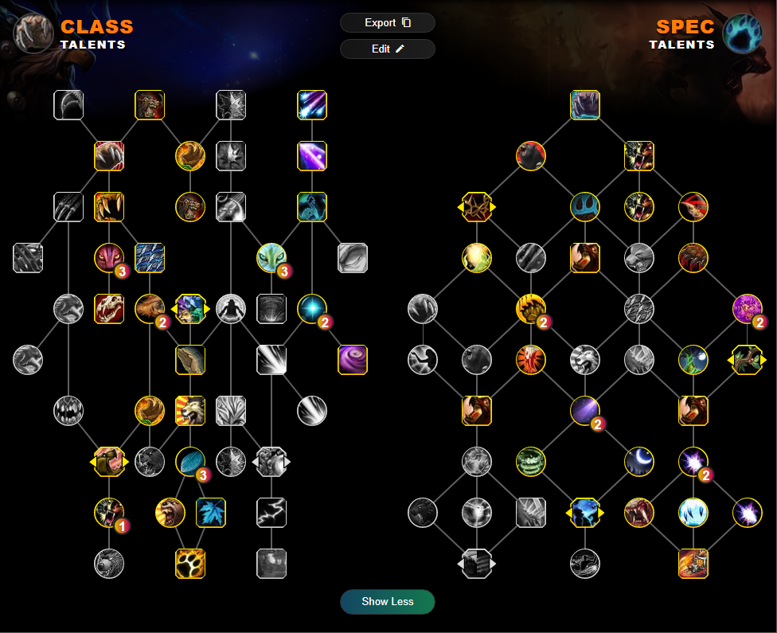
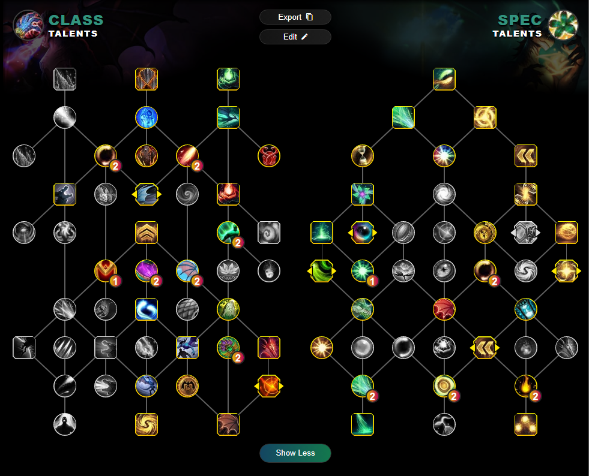
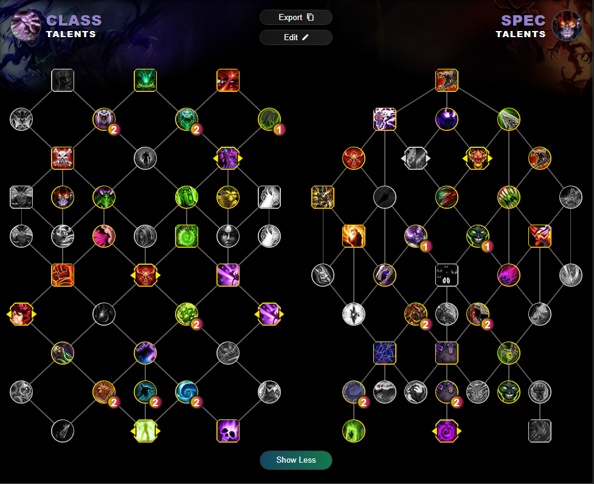

# Karoshi vs Raszageth

## Talents 
* Talents have been taken after changes on the 24th of Jan class changes
* Any changes or additions feel free to DM Madrexus#0001
* Talants are the most common I have seen for the fight, Don't think of anything too innovative unless its warlock or spriest where I have half an idea on what's going on.

|Tanks|Healers|Melee DPS|Range DPS|
|-------------------------------------------|-------------------------------------------|---------|---------|
|[Blood Death Knight](#blood-death-knight)  |[Restoration Druid](#restoration-druid)    |[Frost Death Knight](#frost-death-knight)  |[Balence Druid](#balence-druid)|
|[Guradian Druid](#guradian-druid)          |[Preservation Evoker](#preservation-evoker)|[Unholy Death Knight](#unholy-death-knight)|[Devastation Evoker](#devastation-evoker)|
|[Brewmaster Monk](#brewmaster-monk)        |[Mistweaver Monk](#mistweaver-monk)        |[Havoc Demon Hunter](#havoc-demon-hunter)  |[Beast Mastery Hunter](#beast-mastery-hunter)|
|[Protection Paladin](#protection-paladin)  |[Holy Paladin](#holy-paladin)              |[Feral Druid](#feral-druid)                |[Marksmanship Hunter](#marksmanship-hunter)|
|[Protection Warrior](#protection-warrior)  |[Holy Priest](#holy-priest)                |[Survival Hunter](#survival-hunter)        |[Arcane Mage](#arcane-mage)|
|                                           |[Discipline Priest](#discipline-priest)    |[Windwalker Monk](#windwalker-monk)        |[Fire Mage](#fire-mage)|
|                                           |[Restoration Shamen](#restoration-shaman)  |[Retribution Paladin](#retribution-paladin)|[Frost Mage](#frost-mage)|
|                                           |                                           |[Assassination Rogue](#assassination-rogue)|[Shadow Priest](#shadow-priest)|
|                                           |                                           |[Outlaw Rogue](#outlaw-rogue)              |[Elemental Shaman](#elemental-shaman)|
|                                           |                                           |[Subtlety Rogue](#subtlety-rogue)          |[Affliction Warlock](#affliction-warlock)|
|                                           |                                           |[Enhancement Shamen](#enhancement-shaman)  |[Demonology Warlock](#demonology-warlock)|
|                                           |                                           |[Arms Warrior](#arms-warrior)              |[Destruction Warlock](#destruction-warlock)|
|                                           |                                           |[Fury Warrior](#fury-warrior)              ||

### Tanks

#### Blood Death Knight
\
Notes: N/A
\
\
Talent String:
\
BoPAAAAAAAAAAAAAAAAAAAAAAACJJCJJi0iERkISIIJSkAAAAAAkIJOQik0EiEAAQkkkEAAAA
\
\

#### Guradian Druid
\
Notes: 1 Log (Pumps GOAT) - Tree from before the 24th, may require some changes.
\
\
Talent String:
\
BgGAAAAAAAAAAAAAAAAAAAAAAAAAAAAAAAAAAAASSkkokokkkEJQQShiAQCCSgkkkkkIFAOAAAAAAARAB
\
\

#### Brewmaster Monk
\
Notes: 1 Log - Might be niche
\
\
Talent String:
\
BwQAAAAAAAAAAAAAAAAAAAAAAAAAAAAAIBAAAAUiWLJJQSSpRAAAASJSLJSkQikIJSJJEaRi0SrEC
\
\

#### Protection Paladin
\
\
Talent String:
\
BIEAAAAAAAAAAAAAAAAAAAAAA0iWCpJaHISSiWTkkEBSAAAAAAAAAAAAAAQTSSSKJQClUEJhokG
\
\

#### Protection Warrior
\
Talent String:
\
BkEAAAAAAAAAAAAAAAAAAAAAAIEJAAAAgkkQSiItkSSSaQEIFFBUSSgCikE0CJJggDECAAAAAAAEBAgSrBA
\
\

### Healers

#### Restoration Druid
\
\
Talent String:
\
BkGAAAAAAAAAAAAAAAAAAAAAAQkkoUSSSUkWIRgU0ikAAAAAAAAAAAAAKChICCSCQSIJShkWCAAAAAARAAA
\
\

#### Preservation Evoker
\
\
Talent String:
\
BwbBAAAAAAAAAAAAAAAAAAAAAQB0yBEhISRSSItokkkgEAAAAAQk0SkACSkkkIh4AJB
\
\

#### Mistweaver Monk
\
Notes: 2 Logs - this is from pre class hotfix, string may not work.
\
\
Talent String:
\
B4QAAAAAAAAAAAAAAAAAAAAAA0CpgEBlWRSEhk0iWiUEAAAAAAAAAAAAAk0CJSSkIIJJNiEHAAQA
\
\

#### Holy Paladin
\
\
Talent String:
\
BEEAAAAAAAAAAAAAAAAAAAAAAAAAAAAABAAAAAAQJJQUSJJ0EpIRSJgWiENJRSKJcgkElUSSAKRA
\
\

#### Holy Priest
\
\
Talent String:
\
BEQAAAAAAAAAAAAAAAAAAAAAAQDAAAAAAAQhodAHIJJSIlQSShSClAAAAAQSahWSC0ISESElCkkQKA
\
\

#### Discipline Priest
\
\
Talent String:
\
BAQAAAAAAAAAAAAAAAAAAAAAAABQSLRCpFRaREtUSSSCAAAAAAAAAAAAEpRaJBSjIBRQpFJSCKB
\
\

#### Restoration Shaman
\
\
Talent String:
\
BgQAAAAAAAAAAAAAAAAAAAAAAAAAAAAAAAAAAAQIRSSkSCppFtE0iWkUSIoE0SBFIFSSDEIJRSA
\
\

### Melee DPS

#### Frost Death Knight
\
\
Talent String:
\
BsPAAAAAAAAAAAAAAAAAAAAAAkIAiIJJkISEhIJhQiIREEQiIRSSSSSSa5AAAAAAAAAAAAAA
\
\

#### Unholy Death Knight
\
Notes: No Logs :(
\
\
Talent String: N/A

#### Havoc Demon Hunter
\
\
Talent String:
\
BEkAAAAAAAAAAAAAAAAAAAAAAQCIhUC0SSkkIlWEAAAAAAAtIBHolCJJFIkWSIJRSSSA
\
\

#### Feral Druid
\
\
Talent String:
\
BcGAAAAAAAAAAAAAAAAAAAAAAAAAAAAAgkSaSkkkIpkGRJJJRSAAAAAAoIASCAQSChkQJhSSCAAAAAAkAKAA
\
\

#### Survival Hunter
\
Notes: No Logs :(
\
\
Talent String: N/A
#### Windwalker Monk
\
\
Talent String:
\
B0QAAAAAAAAAAAAAAAAAAAAAAAAAAAAAAQSkkElISEAAAAQkkESEIJJQSLSEJkIJJJJtkAAAA
\
\

\
#### Retribution Paladin
\
Notes: 1 Log - Pre class changes, may not work
\
\
Talent String:
\
BYEAAAAAAAAAAAAAAAAAAAAAAAAAAAAgIBIiSaJJEQSSapkkElAAAAAAAINRSSaCkE0SSSUiSA
\
\

#### Assassination Rogue
\
\
Talent String:
\
BMQAAAAAAAAAAAAAAAAAAAAAAINJSCkQJBAAAAAAQSAkIAAAAAAA0iEOQJJkkkkWKJiEkQkYBB
\
\

#### Outlaw Rogue
\
\
Talent String:
\
BQQAAAAAAAAAAAAAAAAAAAAAAAAAgERSAkkQikkgkEJRikkkkkIAAAAAAARLgUSCIRaBAAAA
\
\

#### Subtlety Rogue
\
\
Talent String:
\
BUQAAAAAAAAAAAAAAAAAAAAAAAAAAAAAAAAARAJJiQASkkgkkEJkERSSUSikUiQSSoEAAAA
\
\

#### Enhancement Shaman
\
\
Talent String:
\
BcQAAAAAAAAAAAAAAAAAAAAAAIJJpkkASCikkQJhAAAAAAAAAAAAAQJCRIhUEFIlkkUAUSkEA
\
\

#### Arms Warrior
\
\
Talent String:
\
BcEAAAAAAAAAAAAAAAAAAAAAAAQplIRkQkkWrkkAAAAABRIKEQREoECJhmEhAESkAAAAAAAAQCkkACRDB
\
\

#### Fury Warrior
\
\
Talent String:
\
BgEAAAAAAAAAAAAAAAAAAAAAAEAAAAAAAAAACBShSAEBpgARDSICEJRSSaJRSEAJJJRapEgkkEAAAAEE
\
\

### Range DPS

#### Balence Druid
\
\
Talent String:
\
BYGAAAAAAAAAAAAAAAAAAAAAAAAAAAAAAAAAAAAAAAAAAKAkkICSCBJJSiUgSikkEpkg4AJh0SKJhgGAhCA
\
\

#### Devastation Evoker
\
\
Talent String:
\
BsbBAAAAAAAAAAAAAAAAAAAAAQBCAAAAAAKapQiIJkQSkUSSSTi0SkIJSiEkkIR4AB
\
\

#### Beast Mastery Hunter
\
\
Talent String:
\
B0PAAAAAAAAAAAAAAAAAAAAAA4AgWSAIEAAAAAAAAAAAaEaSoJRikIRCaSkWIJkIkoRSE
\
\

#### Marksmanship Hunter
\
\
Talent String:
\
B4PAAAAAAAAAAAAAAAAAAAAAA4ARoFASCCCAAAAQkERSSigIRSLkGRoVkimQSSIhgGAAAAA
\
\

#### Arcane Mage
\
\
Talent String:
\
B4DAAAAAAAAAAAAAAAAAAAAAAIJCSaJCHIJFQ0SIiISiESolg0SCAAAAAAAAAAAQSSSSIJJJA
\
\

#### Fire Mage
\
Notes: Log from pre class changes, build could be out of date.
\
\
Talent String:
\
B8DAAAAAAAAAAAAAAAAAAAAAAkkIEaJScgkUA5AtEiICJAAAAAAAAA4AEIRokkIJOQSSSSBAAAA
\
\

#### Frost Mage
\
Notes: No Logs :(
\
\
Talent String: N/A

#### Shadow Priest
\
\
Talent String:
\
BIQAAAAAAAAAAAAAAAAAAAAAAIi0iEAAAAAAAAAAAAAikoEpJFikkUSIRQakkkINShEESRahkAA
\
\

#### Elemental Shaman
\
\
Talent String:
\
BYQAAAAAAAAAAAAAAAAAAAAAAAAAAAAgUSrIJtkAJINKBtkkkDAAAAAAAlAkSSUSTUgDUSSSDgkQSA
\
\

#### Affliction Warlock
\
\
Talent String:
\
BkQAAAAAAAAAAAAAAAAAAAAAAARSSkIBSLNlgUkkEpEAAAAoRCAAAAAAkIakkIRSS0SIAA
\
\

#### Demonology Warlock
\
\
Talent String:
\
BoQAAAAAAAAAAAAAAAAAAAAAAgESSkIg00SJIlDkkQaBAAAAAtIJJhEIhEJHISLJyBIAAAAAAA
\
\

#### Destruction Warlock
\
Notes: No Logs :(
\
\
Talent String: N/A